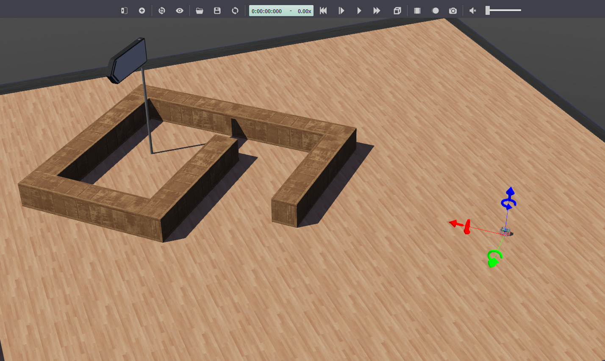
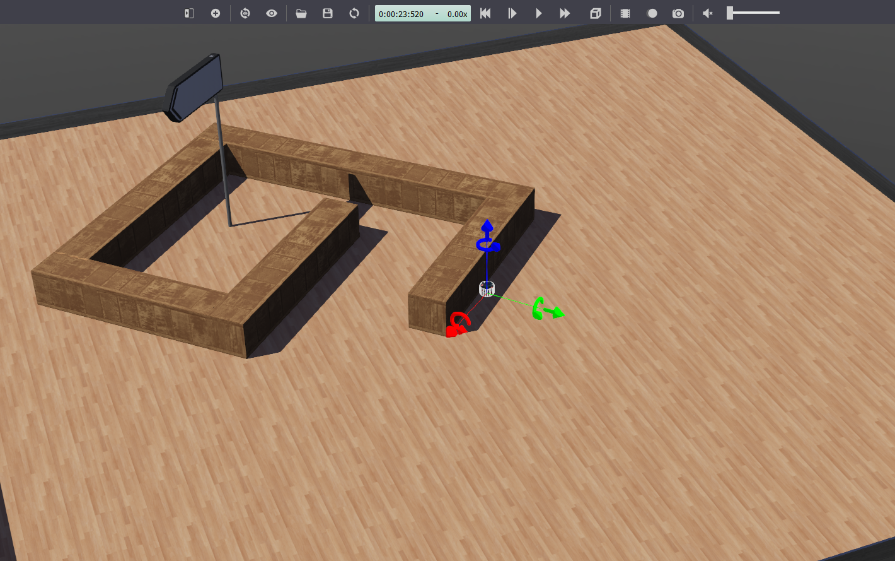
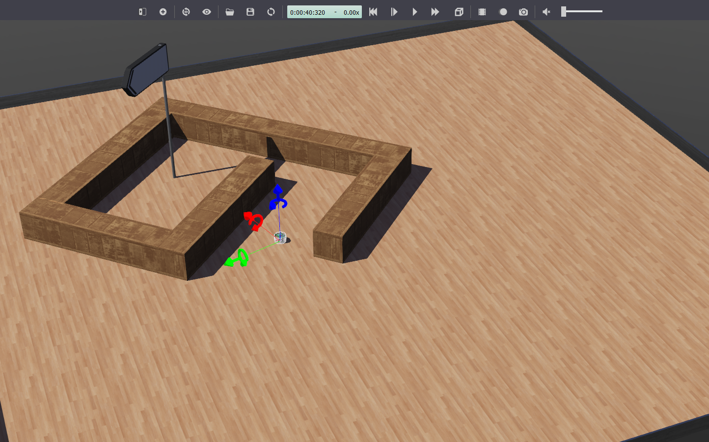

# Solutions

## Task 1: Functions for coordinate geometry

Code implemented in: [`Assignment1/helper_functions.py`](https://github.com/JaydevSR/Intelligent-Robotics-Course-Project/blob/57092d7d8754d7f8c299b8b0639238a2deb6cd29/Assignment1/helper_functions.py)

## Task 2: Bug-0 algorithm implementation

Controller implemented in: [`Assignment1/bug0_controller.py`](https://github.com/JaydevSR/Intelligent-Robotics-Course-Project/blob/57092d7d8754d7f8c299b8b0639238a2deb6cd29/Assignment1/bug0_controller.py)

_Scenario where goal never reachable_:

1. Start:  
2. Following the obstacle: 
3. Leaving the obstacle: 
4. Following the obstacle again: 

## Task 3: Flowchart for right-turning Bug-0 algorithm

TODO: Insert image

## Task 4: Proof for incompleteness of Bug-0 algorithm

For a complete algorithm that reaches the goal, the path is given by $\mathcal P = (s, h_1, l_1, ..., h_n, l_n, g)$. Here, $s$ and $g$ are the start and the goal positions respectively and $h_i$ and $l_i$ are the $i^{th}$ hit point and leave point respectively. Consider the scenario in Bug-0 algorithm where, $h_i$ and $h_{i+1}$ lie on the same obstacle $O_k$. In this case we can note that the leave-point $l_{i+1} = l_i$ due to the deterministic way of finding such leave points on the obstacle boundary. Hence, all the consecuent hit and leave points will lie on the same obstacle $O_k$ and the bug will never leave the obstacle. Such a scenario can arise when the obstacle is in form of spiral as an example. This make Bug-0 algorithm *incomplete*.

## Task 5: Bug-2 algorithm implementation

Controller implemented in: [`Assignment1/bug2_controller.py`](https://github.com/JaydevSR/Intelligent-Robotics-Course-Project/blob/57092d7d8754d7f8c299b8b0639238a2deb6cd29/Assignment1/bug2_controller.py)

_Scenario with 4 rectangular obstacles_:

TODO: Insert images

## Task 6: Bug-2 without memory not complete

TODO: Insert images

## Task 7: Trapezoidal decomposition and Reeb graph for above environment

TODO: Insert images

## Task 8: Lawn-mower pattern with sensing radius equal to the size of the robot

TODO: Insert Images

## Task 9: Pursuit-Evasion game

TODO: Implementation of controller

---
